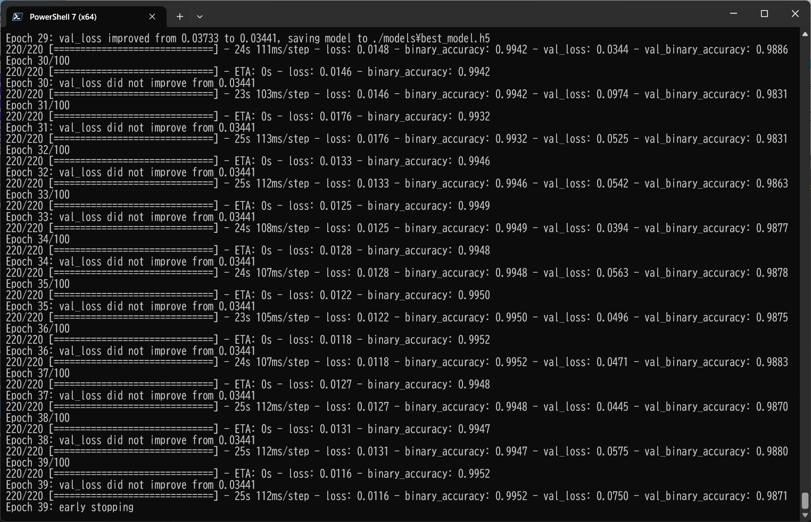
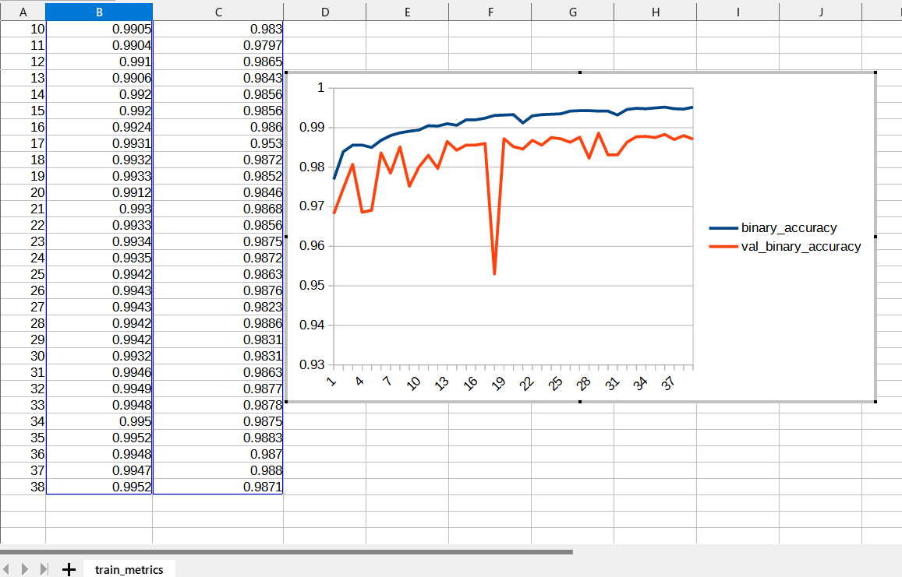
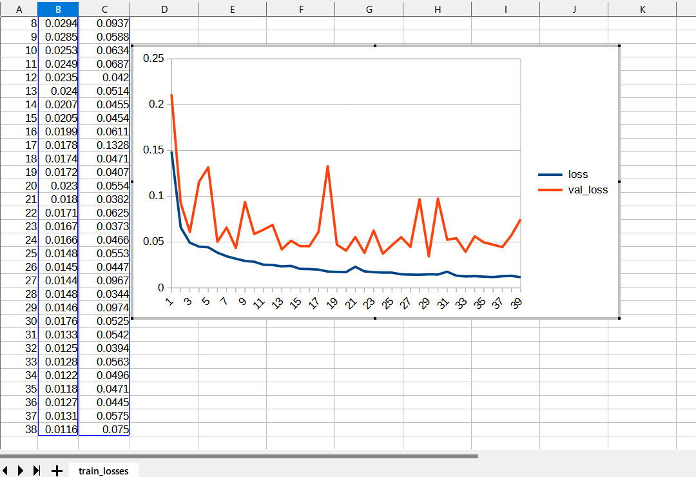
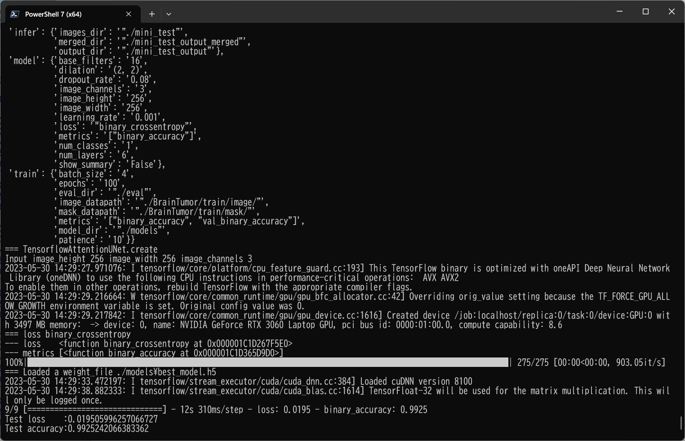
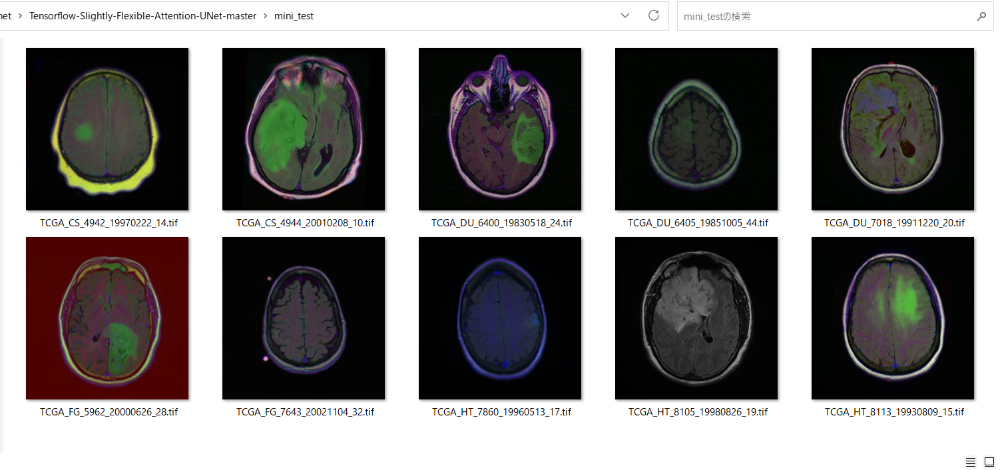
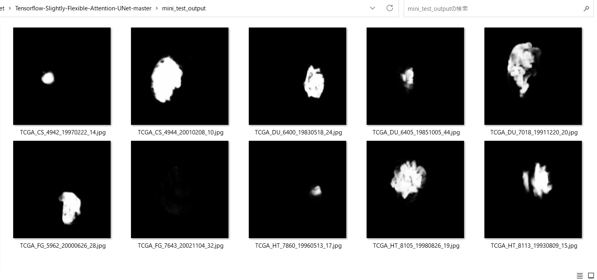
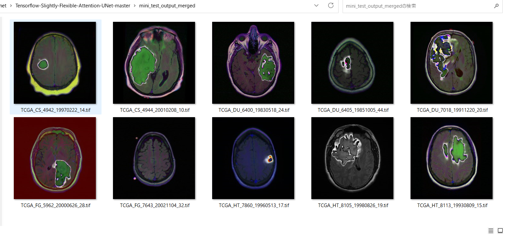

# Tensorflow-Slightly-Flexible-Attention-UNet (Updated: 2023/05/30)

<h2>
1 Tensorflow Attention UNet Model
</h2>

This is a slightly flexible Attention UNet Model Implementation by Tensorflow 2, which is slightly flexibly cusomizable by a configuration file.

In order to write the extensible Attention UNet Model, we have used the Python scripts in the following web sites.

<pre>
1. Semantic-Segmentation-Architecture
 https://github.com/nikhilroxtomar/Semantic-Segmentation-Architecture/blob/main/TensorFlow/attention-unet.py
</pre>

See also:

<pre>
2. U-Net: Convolutional Networks for Biomedical Image Segmentation
 https://arxiv.org/pdf/1505.04597.pdf
</pre>

The image dataset used here has been taken from the following web site.

<b>
Brain MRI segmentation</b> 
<pre>
https://www.kaggle.com/datasets/mateuszbuda/lgg-mri-segmentation
</pre>

About Dataset 
LGG Segmentation Dataset 
Dataset used in: 

Mateusz Buda, AshirbaniSaha, Maciej A. Mazurowski "Association of genomic subtypes of 
lower-grade gliomas with shape features automatically extracted by a deep learning 
algorithm." Computers in Biology and Medicine, 2019.
and
Maciej A. Mazurowski, Kal Clark, Nicholas M. Czarnek, Parisa Shamsesfandabadi, 
Katherine B. Peters, Ashirbani Saha "Radiogenomics of lower-grade glioma: 
algorithmically-assessed tumor shape is associated with tumor genomic subtypes 
and patient outcomes in a multi-institutional study with 
The Cancer Genome Atlas data." Journal of Neuro-Oncology, 2017.

This dataset contains brain MR images together with manual FLAIR abnormality 
segmentation masks.
The images were obtained from The Cancer Imaging Archive (TCIA).
They correspond to 110 patients included in The Cancer Genome Atlas (TCGA) 
lower-grade glioma collection with at least fluid-attenuated inversion recovery (FLAIR) 
sequence and genomic cluster data available.
Tumor genomic clusters and patient data is provided in data.csv file.

<h2>
2 Create TensorflowAttentionUNet Model
</h2>
 You can customize your <a href="./TensorflowAttentionUNet.py">TensorflowAttentionUNet</a> model by using a configration file. 
 The following is the case of MRI BrainTumor segmentation dataset. 
<pre>
; train_eval_infer.config
; 2023/5/28 antillia.com
; Modified to use loss and metric
; Specify loss as a function nams
; loss =  "binary_crossentropy"
; Specify metrics as a list of function name
; metrics = ["binary_accuracy"]
; Please see: https://www.tensorflow.org/api_docs/python/tf/keras/Model?version=stable#compile

[model]
image_width    = 256
image_height   = 256
image_channels = 3
num_classes    = 1
base_filters   = 16
num_layers     = 6
learning_rate  = 0.001
dilation       = (2, 2)
loss           = "binary_crossentropy"
metrics        = ["binary_accuracy"]
show_summary   = True

[train]
epochs        = 100
batch_size    = 4
patience      = 10
metrics       = ["binary_accuracy", "val_binary_accuracy"]
model_dir     = "./models"
eval_dir      = "./eval"
image_datapath = "./BrainTumor/train/image/"
mask_datapath  = "./BrainTumor/train/mask/"

[eval]
image_datapath = "./BrainTumor/test/image/"
mask_datapath  = "./BrainTumor/test/mask/"
output_dir     = "./eval_output"

[infer] 
images_dir    = "./mini_test" 
output_dir    = "./mini_test_output"
merged_dir    = "./mini_test_output_merged"
</pre>
<!--
<table width="720" >

<tr>
<td>image_width and image_height</td>
<td>
The input image size to the first layer of Encoder. 
These values must be the same size and can take a multiple of 128. The size will depend on the dataset to be used to train your UNet Model.
</td>
</tr>

<tr>
<td>num_classes</td>
<td>The number of classes of dataset.</td>
</tr>

<tr>
<td>base_filters</td>
<td>The number of initial filters for Conv2D layer.</td>
</tr>
<tr>
<td>num_layers</td>
<td>
The number of blocks of Decoder and Encoder. 
</td>
</tr>

<tr>
<td>learning_rate</td>
<td>The learining_rate for Adam optimizer </td>
</tr>

</table>
-->
 
You will pass the filename of this configuration file to <a href="./TensorflowAttentionUNet.py">TensorflowAttentionUNet</a> constructor to create your model 
in the following way: 
<pre>
  config_file = "./train_eval_infer.config"
  model       = TensorflowAttentionUNet(config_file)
</pre>

Our <b>create</b> method in the <b>TensorflowAttentionUNet</b> class which inherits <a href="./TensorflowUNet.py">TensorflowUNet</a> class
 is the following.
It mainly consists of two parts Encoder and Decoder, which are written by <b>for</b> loops depending
on <b>num_layers</b> defined in the configuration file. 
<pre>

class TensorflowAttentionUNet(TensorflowUNet):

  def __init__(self, config_file):
    super().__init__(config_file)

  # The following methods have been take from the following code.
  # https://github.com/nikhilroxtomar/Semantic-Segmentation-Architecture/blob/main/TensorFlow/attention-unet.py
  def conv_block(self, x, num_filters):
    x = Conv2D(num_filters, 3, padding="same")(x)
    x = BatchNormalization()(x)
    x = Activation("relu")(x)
    x = Conv2D(num_filters, 3, padding="same")(x)
    x = BatchNormalization()(x)
    x = Activation("relu")(x)
    return x

  def encoder_block(self, x, num_filters):
    x = self.conv_block(x, num_filters)
    p = MaxPool2D((2, 2))(x)
    return x, p

  def attention_gate(self, g, s, num_filters):
    Wg = Conv2D(num_filters, 1, padding="same")(g)
    Wg = BatchNormalization()(Wg)
    Ws = Conv2D(num_filters, 1, padding="same")(s)
    Ws = BatchNormalization()(Ws)
    out = Activation("relu")(Wg + Ws)
    out = Conv2D(num_filters, 1, padding="same")(out)
    out = Activation("sigmoid")(out)
    return out * s

  def decoder_block(self, x, s, num_filters):
    x = UpSampling2D(interpolation="bilinear")(x)
    s = self.attention_gate(x, s, num_filters)
    x = Concatenate()([x, s])
    x = self.conv_block(x, num_filters)
    return x

  # Customizable by the parameters in a configuration file.
  def create(self, num_classes, image_height, image_width, image_channels,
            base_filters = 16, num_layers = 5):
    print("=== TensorflowAttentionUNet.create ")
    print("Input image_height {} image_width {} image_channels {}".format(image_height, image_width, image_channels))
    inputs = Input((image_height, image_width, image_channels))

    p = Lambda(lambda x: x / 255)(inputs)
    #Encoder block
    enc = []
    d   = None
    for i in range(num_layers):
      filters = base_filters * (2**i)
      if i < num_layers-1:
        s, p    = self.encoder_block(p, filters)
        enc.append(s)
      else:
        d = self.conv_block(p, filters)

    #Decoder block
    enc_len = len(enc)
    enc.reverse()
    n = 0
    for i in range(num_layers-1):
      f = enc_len - 1 - i
      filters = base_filters* (2**f)
      s = enc[n]
      d = self.decoder_block(d, s, filters)
      n += 1

    outputs = Conv2D(num_classes, (1, 1), activation='sigmoid')(d)
    model = Model(inputs=[inputs], outputs=[outputs], name="Attention-UNET")
    return model
</pre>

You can create TensorflowAttentionUNet Model by running the following command. 
<pre>
>python TensorflowAttentionUNet.py
</pre>
You will see the summary of the model. 
Please see Appendix

<h2>
3 Train TensorflowAttentionUNet Model
</h2>

 You can create and train your TensorflowAttentionUNet model by BrainTumor dataset defined in the <b>train_eval_infer.config</b> file. 

We have created <a href="./BrainTumorDataset.py">BrainTumorDataset</a> class to create <b>train</b> and <b>test</b> dataset from the 
the original downloaded file.. 
<pre>
>python TensorflowAttentionUNetBrainTumorTrainer.py
</pre>

In this case, the training process has just been stopped at epoch 64 by that callback.  
 
 
<b>Train accuracies line graph</b>: 
 

 
<b>Train losses line graph</b>: 
 

<h2>
4 Evaluation
</h2>
 We can evaluate the prediction accuracy in <b>test</b> dataset by using our Trained TensorflowAttentionUNet Model,
and <b>train_eval_infer.config</b> file. 

Please run the Python script <a href="./TensorflowAttentionUNetBrainTumoEvaluatorpy">TensorflowAttentionUNetBrainTumorEvaluator.py</a> 
in the following way. 
<pre>
>python TensorflowAttentionUNetBrainTumorEvaluator.py
</pre>

 
 

<h2>
5 Inference 
</h2>
 We can infer nuclei in <b>mini_test</b> dataset, which is a set of ten image files 
extracted from the images in "stage1_test" folder, by using our Trained TensorflowUNet Model,

Please run the Python script <a href="./TensorflowAttentionUNetBrainTumorInfer.py">TensorflowAttentionUNetBrainTumorInfer.py</a> 
in the following way. 
<pre>
>python TensorflowAttentionUNetBrainTumorInfer.py
</pre>
This inference process will create the grayscale image files with white predicted nuclei regions, 
and those images will have the same size of the original input images respectively. Therefore, you can easily compare 
the input images and the infered output images.  

<b>Input images (mini_test) </b> 
 
 
<b>Infered images (mini_test_output)</b> 

  

<b>Merged infered images (mini_test_output_merged)</b> 

  

<h3>
References
</h3>
<b>1. Brain MRI segmentation</b> 
<pre>
https://www.kaggle.com/datasets/mateuszbuda/lgg-mri-segmentation
</pre>
<b>2. Brain tumor segmentation based on deep learning and an attention mechanism using MRI multi-modalities brain images</b> 
Ramin Ranjbarzadeh, Abbas Bagherian Kasgari, Saeid Jafarzadeh Ghoushchi,  
Shokofeh Anari, Maryam Naseri & Malika Bendechache  
<pre>
https://www.nature.com/articles/s41598-021-90428-8
</pre>
<b>3. Deep learning based brain tumor segmentation: a survey</b> 
Zhihua Liu, Lei Tong, Long Chen, Zheheng Jiang, Feixiang Zhou, 
Qianni Zhang, Xiangrong Zhang, Yaochu Jin & Huiyu Zhou
 
<pre>
https://link.springer.com/article/10.1007/s40747-022-00815-5
</pre>

<b>4. EfficientDet-MRI-Brain-Tumor</b> 
Toshiyuki Arai @antillia.com 
<pre>
https://github.com/sarah-antillia/EfficientDet-MRI-Brain-Tumor
</pre>
<b>5. Image-Segmentation-Brain-Tumor</b> 
Toshiyuki Arai @antillia.com 
<pre>
https://github.com/atlan-antillia/Image-Segmentation-Brain-Tumor
</pre>

<b>6. Semantic-Segmentation-Loss-Functions (SemSegLoss)</b> 
<pre>
https://github.com/shruti-jadon/Semantic-Segmentation-Loss-Functions
</pre>
<pre>
Citation
@inproceedings{jadon2020survey,
  title={A survey of loss functions for semantic segmentation},
  author={Jadon, Shruti},
  booktitle={2020 IEEE Conference on Computational Intelligence in Bioinformatics and Computational Biology (CIBCB)},
  pages={1--7},
  year={2020},
  organization={IEEE}
}
@article{JADON2021100078,
title = {SemSegLoss: A python package of loss functions for semantic segmentation},
journal = {Software Impacts},
volume = {9},
pages = {100078},
year = {2021},
issn = {2665-9638},
doi = {https://doi.org/10.1016/j.simpa.2021.100078},
url = {https://www.sciencedirect.com/science/article/pii/S2665963821000269},
author = {Shruti Jadon},
keywords = {Deep Learning, Image segmentation, Medical imaging, Loss functions},
abstract = {Image Segmentation has been an active field of research as it has a wide range of applications, 
ranging from automated disease detection to self-driving cars. In recent years, various research papers 
proposed different loss functions used in case of biased data, sparse segmentation, and unbalanced dataset. 
In this paper, we introduce SemSegLoss, a python package consisting of some of the well-known loss functions 
widely used for image segmentation. It is developed with the intent to help researchers in the development 
of novel loss functions and perform an extensive set of experiments on model architectures for various 
applications. The ease-of-use and flexibility of the presented package have allowed reducing the development 
time and increased evaluation strategies of machine learning models for semantic segmentation. Furthermore, 
different applications that use image segmentation can use SemSegLoss because of the generality of its 
functions. This wide range of applications will lead to the development and growth of AI across all industries.
}
}
</pre>
 

<h3>
Appendix:
</h3>
<pre>
Model: "Attention-UNET"
__________________________________________________________________________________________________
 Layer (type)                   Output Shape         Param #     Connected to
==================================================================================================
 input_1 (InputLayer)           [(None, 256, 256, 3  0           []
                                )]

 lambda (Lambda)                (None, 256, 256, 3)  0           ['input_1[0][0]']

 conv2d (Conv2D)                (None, 256, 256, 16  448         ['lambda[0][0]']
                                )

 batch_normalization (BatchNorm  (None, 256, 256, 16  64         ['conv2d[0][0]']
 alization)                     )

 activation (Activation)        (None, 256, 256, 16  0           ['batch_normalization[0][0]']
                                )

 conv2d_1 (Conv2D)              (None, 256, 256, 16  2320        ['activation[0][0]']
                                )

 batch_normalization_1 (BatchNo  (None, 256, 256, 16  64         ['conv2d_1[0][0]']
 rmalization)                   )

 activation_1 (Activation)      (None, 256, 256, 16  0           ['batch_normalization_1[0][0]']
                                )

 max_pooling2d (MaxPooling2D)   (None, 128, 128, 16  0           ['activation_1[0][0]']
                                )

 conv2d_2 (Conv2D)              (None, 128, 128, 32  4640        ['max_pooling2d[0][0]']
                                )

 batch_normalization_2 (BatchNo  (None, 128, 128, 32  128        ['conv2d_2[0][0]']
 rmalization)                   )

 activation_2 (Activation)      (None, 128, 128, 32  0           ['batch_normalization_2[0][0]']
                                )

 conv2d_3 (Conv2D)              (None, 128, 128, 32  9248        ['activation_2[0][0]']
                                )

 batch_normalization_3 (BatchNo  (None, 128, 128, 32  128        ['conv2d_3[0][0]']
 rmalization)                   )

 activation_3 (Activation)      (None, 128, 128, 32  0           ['batch_normalization_3[0][0]']
                                )

 max_pooling2d_1 (MaxPooling2D)  (None, 64, 64, 32)  0           ['activation_3[0][0]']

 conv2d_4 (Conv2D)              (None, 64, 64, 64)   18496       ['max_pooling2d_1[0][0]']

 batch_normalization_4 (BatchNo  (None, 64, 64, 64)  256         ['conv2d_4[0][0]']
 rmalization)

 activation_4 (Activation)      (None, 64, 64, 64)   0           ['batch_normalization_4[0][0]']

 conv2d_5 (Conv2D)              (None, 64, 64, 64)   36928       ['activation_4[0][0]']

 batch_normalization_5 (BatchNo  (None, 64, 64, 64)  256         ['conv2d_5[0][0]']
 rmalization)

 activation_5 (Activation)      (None, 64, 64, 64)   0           ['batch_normalization_5[0][0]']

 max_pooling2d_2 (MaxPooling2D)  (None, 32, 32, 64)  0           ['activation_5[0][0]']

 conv2d_6 (Conv2D)              (None, 32, 32, 128)  73856       ['max_pooling2d_2[0][0]']

 batch_normalization_6 (BatchNo  (None, 32, 32, 128)  512        ['conv2d_6[0][0]']
 rmalization)

 activation_6 (Activation)      (None, 32, 32, 128)  0           ['batch_normalization_6[0][0]']

 conv2d_7 (Conv2D)              (None, 32, 32, 128)  147584      ['activation_6[0][0]']

 batch_normalization_7 (BatchNo  (None, 32, 32, 128)  512        ['conv2d_7[0][0]']
 rmalization)

 activation_7 (Activation)      (None, 32, 32, 128)  0           ['batch_normalization_7[0][0]']

 max_pooling2d_3 (MaxPooling2D)  (None, 16, 16, 128)  0          ['activation_7[0][0]']

 conv2d_8 (Conv2D)              (None, 16, 16, 256)  295168      ['max_pooling2d_3[0][0]']

 batch_normalization_8 (BatchNo  (None, 16, 16, 256)  1024       ['conv2d_8[0][0]']
 rmalization)

 activation_8 (Activation)      (None, 16, 16, 256)  0           ['batch_normalization_8[0][0]']

 conv2d_9 (Conv2D)              (None, 16, 16, 256)  590080      ['activation_8[0][0]']

 batch_normalization_9 (BatchNo  (None, 16, 16, 256)  1024       ['conv2d_9[0][0]']
 rmalization)

 activation_9 (Activation)      (None, 16, 16, 256)  0           ['batch_normalization_9[0][0]']

 max_pooling2d_4 (MaxPooling2D)  (None, 8, 8, 256)   0           ['activation_9[0][0]']

 conv2d_10 (Conv2D)             (None, 8, 8, 512)    1180160     ['max_pooling2d_4[0][0]']

 batch_normalization_10 (BatchN  (None, 8, 8, 512)   2048        ['conv2d_10[0][0]']
 ormalization)

 activation_10 (Activation)     (None, 8, 8, 512)    0           ['batch_normalization_10[0][0]']

 conv2d_11 (Conv2D)             (None, 8, 8, 512)    2359808     ['activation_10[0][0]']

 batch_normalization_11 (BatchN  (None, 8, 8, 512)   2048        ['conv2d_11[0][0]']
 ormalization)

 activation_11 (Activation)     (None, 8, 8, 512)    0           ['batch_normalization_11[0][0]']

 up_sampling2d (UpSampling2D)   (None, 16, 16, 512)  0           ['activation_11[0][0]']

 conv2d_12 (Conv2D)             (None, 16, 16, 256)  131328      ['up_sampling2d[0][0]']

 conv2d_13 (Conv2D)             (None, 16, 16, 256)  65792       ['activation_9[0][0]']

 batch_normalization_12 (BatchN  (None, 16, 16, 256)  1024       ['conv2d_12[0][0]']
 ormalization)

 batch_normalization_13 (BatchN  (None, 16, 16, 256)  1024       ['conv2d_13[0][0]']
 ormalization)

 tf.__operators__.add (TFOpLamb  (None, 16, 16, 256)  0          ['batch_normalization_12[0][0]',
 da)                                                              'batch_normalization_13[0][0]']

 activation_12 (Activation)     (None, 16, 16, 256)  0           ['tf.__operators__.add[0][0]']

 conv2d_14 (Conv2D)             (None, 16, 16, 256)  65792       ['activation_12[0][0]']

 activation_13 (Activation)     (None, 16, 16, 256)  0           ['conv2d_14[0][0]']

 tf.math.multiply (TFOpLambda)  (None, 16, 16, 256)  0           ['activation_13[0][0]',
                                                                  'activation_9[0][0]']

 concatenate (Concatenate)      (None, 16, 16, 768)  0           ['up_sampling2d[0][0]',
                                                                  'tf.math.multiply[0][0]']

 conv2d_15 (Conv2D)             (None, 16, 16, 256)  1769728     ['concatenate[0][0]']

 batch_normalization_14 (BatchN  (None, 16, 16, 256)  1024       ['conv2d_15[0][0]']
 ormalization)

 activation_14 (Activation)     (None, 16, 16, 256)  0           ['batch_normalization_14[0][0]']

 conv2d_16 (Conv2D)             (None, 16, 16, 256)  590080      ['activation_14[0][0]']

 batch_normalization_15 (BatchN  (None, 16, 16, 256)  1024       ['conv2d_16[0][0]']
 ormalization)

 activation_15 (Activation)     (None, 16, 16, 256)  0           ['batch_normalization_15[0][0]']

 up_sampling2d_1 (UpSampling2D)  (None, 32, 32, 256)  0          ['activation_15[0][0]']

 conv2d_17 (Conv2D)             (None, 32, 32, 128)  32896       ['up_sampling2d_1[0][0]']

 conv2d_18 (Conv2D)             (None, 32, 32, 128)  16512       ['activation_7[0][0]']

 batch_normalization_16 (BatchN  (None, 32, 32, 128)  512        ['conv2d_17[0][0]']
 ormalization)

 batch_normalization_17 (BatchN  (None, 32, 32, 128)  512        ['conv2d_18[0][0]']
 ormalization)

 tf.__operators__.add_1 (TFOpLa  (None, 32, 32, 128)  0          ['batch_normalization_16[0][0]',
 mbda)                                                            'batch_normalization_17[0][0]']

 activation_16 (Activation)     (None, 32, 32, 128)  0           ['tf.__operators__.add_1[0][0]']

 conv2d_19 (Conv2D)             (None, 32, 32, 128)  16512       ['activation_16[0][0]']

 activation_17 (Activation)     (None, 32, 32, 128)  0           ['conv2d_19[0][0]']

 tf.math.multiply_1 (TFOpLambda  (None, 32, 32, 128)  0          ['activation_17[0][0]',
 )                                                                'activation_7[0][0]']

 concatenate_1 (Concatenate)    (None, 32, 32, 384)  0           ['up_sampling2d_1[0][0]',
                                                                  'tf.math.multiply_1[0][0]']

 conv2d_20 (Conv2D)             (None, 32, 32, 128)  442496      ['concatenate_1[0][0]']

 batch_normalization_18 (BatchN  (None, 32, 32, 128)  512        ['conv2d_20[0][0]']
 ormalization)

 activation_18 (Activation)     (None, 32, 32, 128)  0           ['batch_normalization_18[0][0]']

 conv2d_21 (Conv2D)             (None, 32, 32, 128)  147584      ['activation_18[0][0]']

 batch_normalization_19 (BatchN  (None, 32, 32, 128)  512        ['conv2d_21[0][0]']
 ormalization)

 activation_19 (Activation)     (None, 32, 32, 128)  0           ['batch_normalization_19[0][0]']

 up_sampling2d_2 (UpSampling2D)  (None, 64, 64, 128)  0          ['activation_19[0][0]']

 conv2d_22 (Conv2D)             (None, 64, 64, 64)   8256        ['up_sampling2d_2[0][0]']

 conv2d_23 (Conv2D)             (None, 64, 64, 64)   4160        ['activation_5[0][0]']

 batch_normalization_20 (BatchN  (None, 64, 64, 64)  256         ['conv2d_22[0][0]']
 ormalization)

 batch_normalization_21 (BatchN  (None, 64, 64, 64)  256         ['conv2d_23[0][0]']
 ormalization)

 tf.__operators__.add_2 (TFOpLa  (None, 64, 64, 64)  0           ['batch_normalization_20[0][0]',
 mbda)                                                            'batch_normalization_21[0][0]']

 activation_20 (Activation)     (None, 64, 64, 64)   0           ['tf.__operators__.add_2[0][0]']

 conv2d_24 (Conv2D)             (None, 64, 64, 64)   4160        ['activation_20[0][0]']

 activation_21 (Activation)     (None, 64, 64, 64)   0           ['conv2d_24[0][0]']

 tf.math.multiply_2 (TFOpLambda  (None, 64, 64, 64)  0           ['activation_21[0][0]',
 )                                                                'activation_5[0][0]']

 concatenate_2 (Concatenate)    (None, 64, 64, 192)  0           ['up_sampling2d_2[0][0]',
                                                                  'tf.math.multiply_2[0][0]']

 conv2d_25 (Conv2D)             (None, 64, 64, 64)   110656      ['concatenate_2[0][0]']

 batch_normalization_22 (BatchN  (None, 64, 64, 64)  256         ['conv2d_25[0][0]']
 ormalization)

 activation_22 (Activation)     (None, 64, 64, 64)   0           ['batch_normalization_22[0][0]']

 conv2d_26 (Conv2D)             (None, 64, 64, 64)   36928       ['activation_22[0][0]']

 batch_normalization_23 (BatchN  (None, 64, 64, 64)  256         ['conv2d_26[0][0]']
 ormalization)

 activation_23 (Activation)     (None, 64, 64, 64)   0           ['batch_normalization_23[0][0]']

 up_sampling2d_3 (UpSampling2D)  (None, 128, 128, 64  0          ['activation_23[0][0]']
                                )

 conv2d_27 (Conv2D)             (None, 128, 128, 32  2080        ['up_sampling2d_3[0][0]']
                                )

 conv2d_28 (Conv2D)             (None, 128, 128, 32  1056        ['activation_3[0][0]']
                                )

 batch_normalization_24 (BatchN  (None, 128, 128, 32  128        ['conv2d_27[0][0]']
 ormalization)                  )

 batch_normalization_25 (BatchN  (None, 128, 128, 32  128        ['conv2d_28[0][0]']
 ormalization)                  )

 tf.__operators__.add_3 (TFOpLa  (None, 128, 128, 32  0          ['batch_normalization_24[0][0]',
 mbda)                          )                                 'batch_normalization_25[0][0]']

 activation_24 (Activation)     (None, 128, 128, 32  0           ['tf.__operators__.add_3[0][0]']
                                )

 conv2d_29 (Conv2D)             (None, 128, 128, 32  1056        ['activation_24[0][0]']
                                )

 activation_25 (Activation)     (None, 128, 128, 32  0           ['conv2d_29[0][0]']
                                )

 tf.math.multiply_3 (TFOpLambda  (None, 128, 128, 32  0          ['activation_25[0][0]',
 )                              )                                 'activation_3[0][0]']

 concatenate_3 (Concatenate)    (None, 128, 128, 96  0           ['up_sampling2d_3[0][0]',
                                )                                 'tf.math.multiply_3[0][0]']

 conv2d_30 (Conv2D)             (None, 128, 128, 32  27680       ['concatenate_3[0][0]']
                                )

 batch_normalization_26 (BatchN  (None, 128, 128, 32  128        ['conv2d_30[0][0]']
 ormalization)                  )

 activation_26 (Activation)     (None, 128, 128, 32  0           ['batch_normalization_26[0][0]']
                                )

 conv2d_31 (Conv2D)             (None, 128, 128, 32  9248        ['activation_26[0][0]']
                                )

 batch_normalization_27 (BatchN  (None, 128, 128, 32  128        ['conv2d_31[0][0]']
 ormalization)                  )

 activation_27 (Activation)     (None, 128, 128, 32  0           ['batch_normalization_27[0][0]']
                                )

 up_sampling2d_4 (UpSampling2D)  (None, 256, 256, 32  0          ['activation_27[0][0]']
                                )

 conv2d_32 (Conv2D)             (None, 256, 256, 16  528         ['up_sampling2d_4[0][0]']
                                )

 conv2d_33 (Conv2D)             (None, 256, 256, 16  272         ['activation_1[0][0]']
                                )

 batch_normalization_28 (BatchN  (None, 256, 256, 16  64         ['conv2d_32[0][0]']
 ormalization)                  )

 batch_normalization_29 (BatchN  (None, 256, 256, 16  64         ['conv2d_33[0][0]']
 ormalization)                  )

 tf.__operators__.add_4 (TFOpLa  (None, 256, 256, 16  0          ['batch_normalization_28[0][0]',
 mbda)                          )                                 'batch_normalization_29[0][0]']

 activation_28 (Activation)     (None, 256, 256, 16  0           ['tf.__operators__.add_4[0][0]']
                                )

 conv2d_34 (Conv2D)             (None, 256, 256, 16  272         ['activation_28[0][0]']
                                )

 activation_29 (Activation)     (None, 256, 256, 16  0           ['conv2d_34[0][0]']
                                )

 tf.math.multiply_4 (TFOpLambda  (None, 256, 256, 16  0          ['activation_29[0][0]',
 )                              )                                 'activation_1[0][0]']

 concatenate_4 (Concatenate)    (None, 256, 256, 48  0           ['up_sampling2d_4[0][0]',
                                )                                 'tf.math.multiply_4[0][0]']

 conv2d_35 (Conv2D)             (None, 256, 256, 16  6928        ['concatenate_4[0][0]']
                                )

 batch_normalization_30 (BatchN  (None, 256, 256, 16  64         ['conv2d_35[0][0]']
 ormalization)                  )

 activation_30 (Activation)     (None, 256, 256, 16  0           ['batch_normalization_30[0][0]']
                                )

 conv2d_36 (Conv2D)             (None, 256, 256, 16  2320        ['activation_30[0][0]']
                                )

 batch_normalization_31 (BatchN  (None, 256, 256, 16  64         ['conv2d_36[0][0]']
 ormalization)                  )

 activation_31 (Activation)     (None, 256, 256, 16  0           ['batch_normalization_31[0][0]']
                                )

 conv2d_37 (Conv2D)             (None, 256, 256, 1)  17          ['activation_31[0][0]']

==================================================================================================
Total params: 8,229,073
Trainable params: 8,221,073
Non-trainable params: 8,000
</pre>

